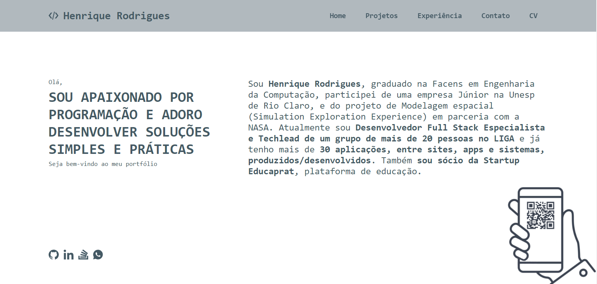
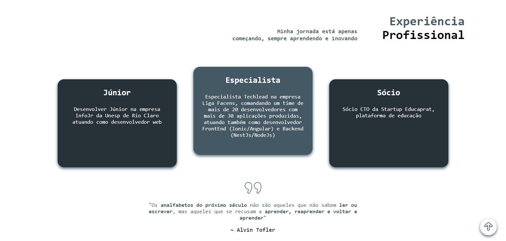

# Portfolio

## Info
- Author: Henrique Rodrigues
- Contact: henrique.rodrigues7@hotmail.com / +55 (11) 971908333
- Website: ...

## Project Prints

## Project checklist

- [ ] Home
    - [x] Header
        - [x] Home
        - [x] Contact
        - [x] Projects
        - [x] Experience
        - [ ] More
        - [ ] Flags (to change website language)  
    - [x] Contact info need to be visible
    - [x] Social Medias
    - [x] QR Code to Whatsapp
    - [x] Experience Layout and quote
    - [ ] Projects
    - [ ] Cool and beatifull info
        - [ ] Total of projects
        - [ ] Total of technologies
- [ ] List projects with search and tags
    - [ ] Search
    - [ ] Tags
    - [ ] List of project cards
- [ ] Project details
    - [ ] Project description
    - [ ] Project video or list of small images
        - [ ] Add zoom library 
    - [ ] Used tecnologics
    - [ ] Let's talk - Wanna get in touch or talk about a project? Feel free to contact me ia email at henrique.rodrigues7@hotmail.com
- [ ] Add accessibility systems
    - [ ] Change website language
        - [ ] US
        - [ ] PT-BR
        - [ ] ES
    - [ ] Libras
    - [ ] Sounds
- [ ] Contact modal
    - [ ] Personal info 
    - [ ] Whatsapp
    - [ ] Email
- [ ] Additional implementations
    - [ ] ThreeJs
    - [ ] Animations
    - [ ] Background parallax
- [ ] More
    - [ ] Articles
        - [ ] Connect with Disqus
    - [ ] Codes
    - [ ] Playgrounds
    - [ ] 3D objects
    - [ ] Tests

## My projects reference
* UQR - https://www.universidadeuqr.com.br/
* Facens - https://play.google.com/store/apps/details?id=liga.app.facens
* ABB - https://www.abb-download.ligafacens.com/
* Yesno - https://play.google.com/store/apps/details?id=liga.app.yesno
* Checkin Campus - https://checkin-campus.com/
* Zoológico PZMQB - https://play.google.com/store/apps/details?id=com.liga.zoologico
* Learnbox - https://play.google.com/store/apps/details?id=liga.app.learnbox&pli=1

## Credits

Direct credits and libs used on this project

